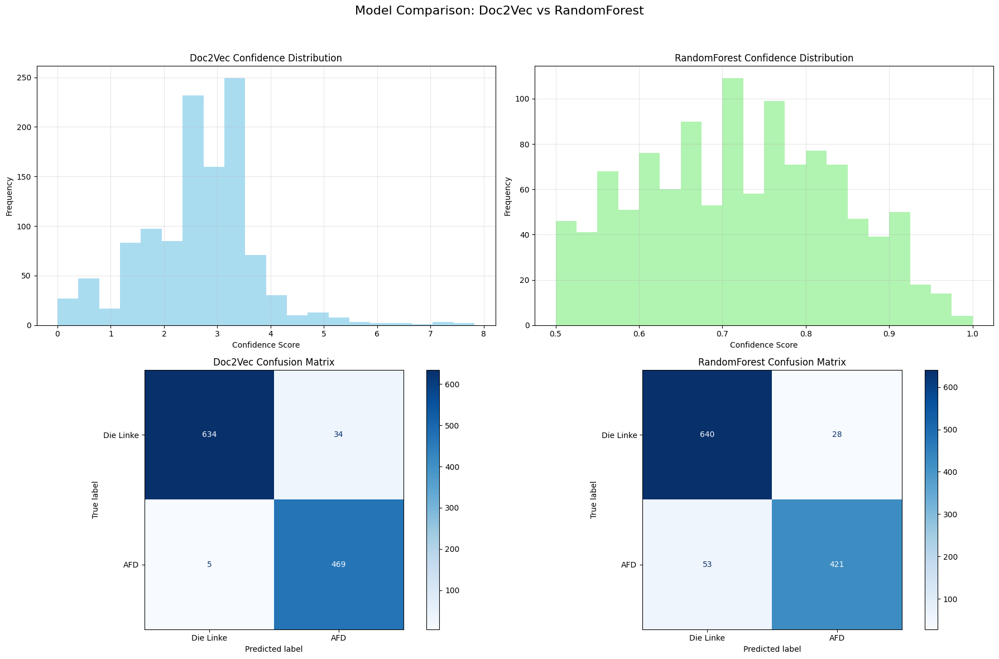

# Political-Speech-Model

## Overview

This repository contains a machine learning pipeline that analyzes and classifies political speeches based on their content, predicting whether they lean politically left, right, or relatively neutral. The project uses natural language processing (NLP) techniques, particularly Doc2Vec, to create vector representations of political speeches and applies classification methods to determine political orientation.

---

## Project Workflow

### 1. Data Collection

#### Transcript 1912 Videos from YouTube official parites channels
- Used `youtube-dl` with custom `ydl_opts` to download audio from ~1,300 YouTube videos from AfD Party (the right-wing German party).
- Deployed four Gradio servers on GPU instances for efficient transcription.
- Utilized OpenAI's Whisper model for accurate speech-to-text transcription
- Implemented transcription function as a Gradio service accessible via API.
- Transported audio files from local machine to GPU servers using Gradio client.
- Retrieved and stored transcripts automatically upon completion.
- Transcription process took approximately 4 days.

#### Additional Data Collection
- Extracted 800 additional transcripts from Left Party ("Die Linke") speeches using the YouTube API.
- Combined all data into a unified dataset for model training.

---

### 2. Dataset Preparation

#### Dataset File: `combined_dataset.json`
Each record includes:
- `transcript`: Full text of the political speech.
- `party`: Political affiliation (`"AFD"` or `"Die Linke"`).

All additional metadata was removed during preprocessing.

---

### 3. Exploratory Data Analysis (EDA)

- Analyzed word frequency distributions across speeches.
- Identified distinct linguistic patterns between political parties.
- Examined speech length distribution and token-level linguistic features.

---

### 4. Model Development – Phase 1

#### Notebook: `doc2vec_plsp_20250422.ipynb`

##### Doc2Vec Model Configuration:
- `vector_size = 256`
- `window = 8`
- `min_count = 5`
- `sample = 1e-4`
- `negative = 5`
- `alpha = 0.05 → 0.001`

##### Similarity Score Function:

```python
def similar_docs_2_scores(similar_docs):
    scores = {}
    for doc_id, similarity in similar_docs:
        num_id = int(doc_id.split("_")[1])
        label = train_df.loc[num_id]["labels"]
        scores[label] = scores.get(label, 0) + similarity
    return scores
```
---

### 5. Model Refinement – Phase 2

#### Notebook: `doc2vec_plsp_20250428.ipynb`

##### 🔧 Data Preprocessing Improvements
- Standardized speech lengths by chunking longer texts to a maximum of **600 words**.
- Removed **German stopwords** to improve signal quality.
- Applied more consistent and cleaner **tokenization** logic.

##### 🧠 Enhanced Doc2Vec Training
- Switched to **PV-DBOW** architecture:
  - `dm=0`
  - `dbow_words=1`
- Updated parameters:
  - `vector_size = 200`
  - `window = 10`
  - `epochs = 40`
  - `negative = 5`
  - `hs = 0` (hierarchical softmax off)

---

### 6. Model Evaluation

#### 🔍 Doc2Vec Similarity-Based Classification
- Inferred a vector for new political speech.
- Retrieved the most similar documents from the training corpus.
- Aggregated similarity scores by political party.
- Assigned the label with the **highest cumulative similarity score**.

#### 🌲 RandomForest Classifier
- Trained a **RandomForest model** using Doc2Vec vectors as features.
- Applied classifier to inferred vectors of unseen/test speeches.

#### 📊 Results
- Evaluated both approaches using **confusion matrices**.




- The **Doc2Vec similarity-based method** slightly outperformed the RandomForest model in classifying test data.

#### Classification Performance Metrics

| Metric | Class | Doc2Vec Similarity | RandomForest Classifier |
|--------|-------|-------------------|------------------------|
| Precision | Die Linke | 0.93 | 0.94 |
|  | AFD | 0.99 | 0.92 |
| Recall | Die Linke | 0.99 | 0.89 |
|  | AFD | 0.95 | 0.96 |
| F1-Score | Die Linke | 0.96 | 0.91 |
|  | AFD | 0.97 | 0.94 |
| Support | Die Linke | 474 | 474 |
|  | AFD | 668 | 668 |
| **Accuracy** |  | **0.97** | **0.93** |
| Macro Avg | | 0.96/0.97/0.97 | 0.93/0.92/0.93 |
| Weighted Avg | | 0.97/0.97/0.97 | 0.93/0.93/0.93 |

Overall Accuracy - Doc2Vec: 0.9658 <br>
Overall Accuracy - RandomForest: 0.9291


Overall Accuracy - Doc2Vec: 0.9658 <br>
Overall Accuracy - RandomForest: 0.9291

Both models performed well on the test data. <br>
The difference bettween the two models that `RandomForest` classifier have higher confidences score that are more than 50%, while the doc2vec similarity confidence approach is rarely above 50%. This might be due to the basic and manule confidence score function developed. This should be studied further. However, the overall performences are well! the model is predicting right most of the time, which is better than random guessing.

---

### 7. Model Deployment

- Built an interactive front-end using **Gradio**.
- Deployed the app on **Hugging Face Spaces**:  
  🔗 [Division Detector AI](https://huggingface.co/spaces/NourSafadi95/right-detector-ai)
- Integrated model into a **Vue.js** web app for interactive exploration and use.
- The model UI is at the end of this page: https://noursaf.github.io/MSDV-thesis-25/ 
---

## 🚀 Usage

To use the model:

1. Visit the [Gradio interface](https://huggingface.co/spaces/NourSafadi95/right-detector-ai) or run it locally.
2. Enter a political speech text into the input field.
3. Receive:
   - A **predicted label**: `left`, `neutral`, or `right`
   - A **confidence score** to assess certainty

---

## Dependencies

- Python 3.8+
- `gensim`
- `nltk`
- `scikit-learn`
- `gradio`
- `pandas`
- `numpy`
- `matplotlib`

